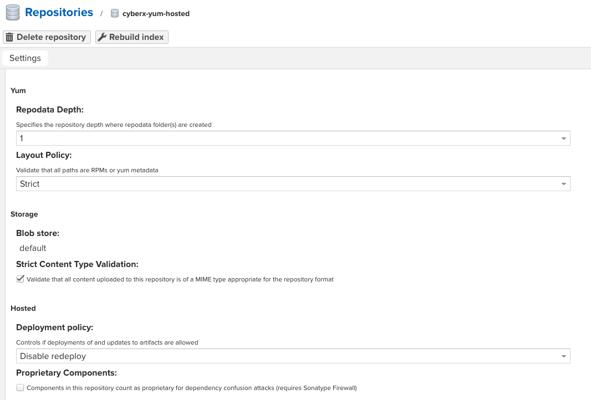

# Using OpenJDK 11 on Cloud Foundry

## Build with Docker

```
docker run --rm \
           -v ~/.m2:/root/.m2 \
           -v "$PWD":/usr/src \
           -w /usr/src \
           maven:3-jdk-11 \
           mvn clean package
```
## Jenkins test for pacifica shard libary.

# RPM BUILD
```
rpmbuild \
           --define "_topdir $(pwd)/rpmbuild" \
           --define "pkg_name cyberx-ems" \
           --define "pkg_version 2.2.0" \
           --define "pkg_release 2" \
           -bb "rpmbuild/SPECS/cyberx-ems.spec"
```

## 创建yum repo file
vim /etc/yum.repos.d/cyberx.repo
```
[cyberx-main]
name=Cyberx Repo
baseurl=http://maven.cyberx.com:8081/repository/cyberx-yum-hosted/cyberx-ems/
gpgcheck=0
enabled=1
```

## nexus setting
